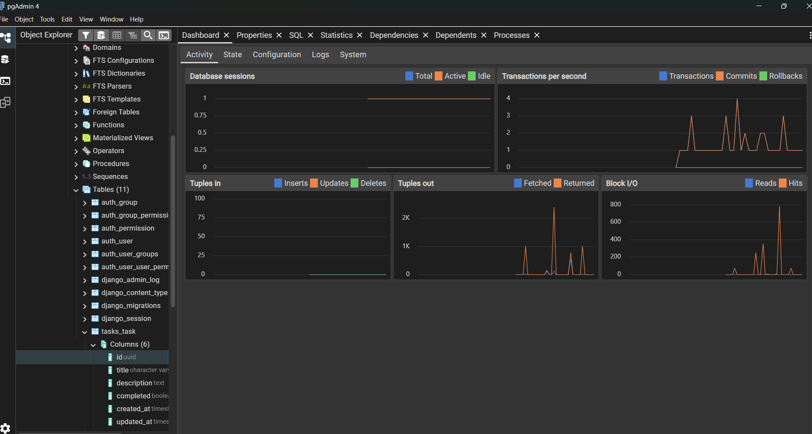
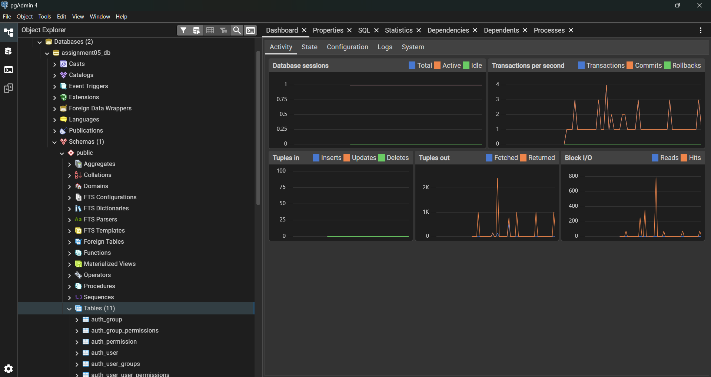
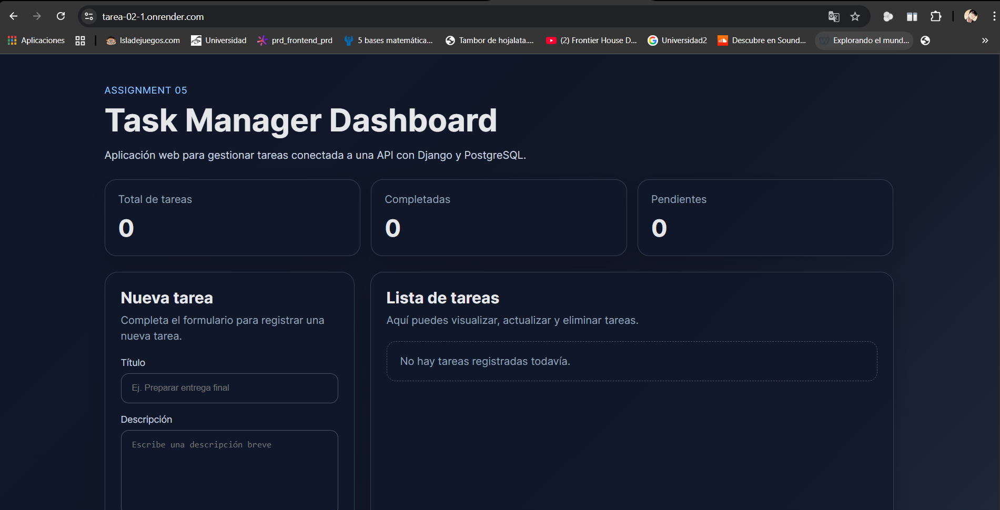
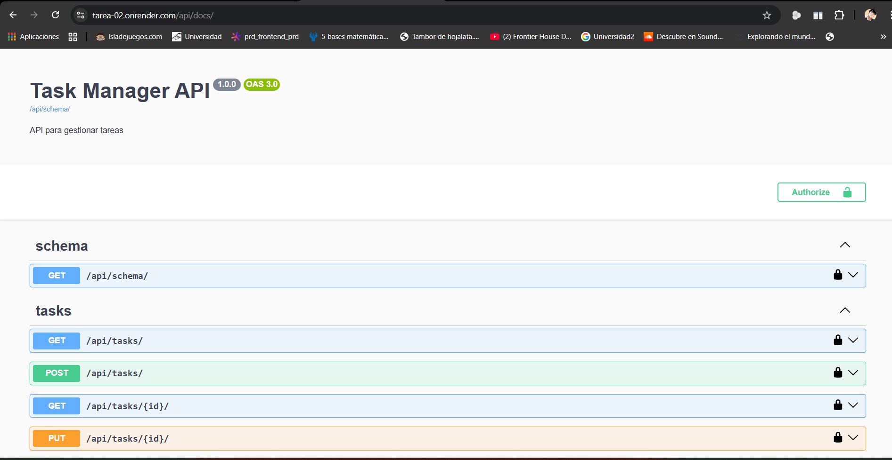
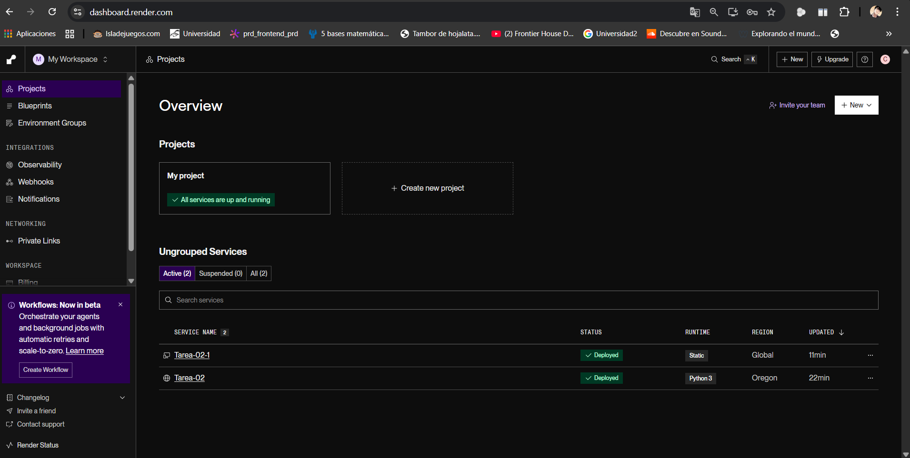
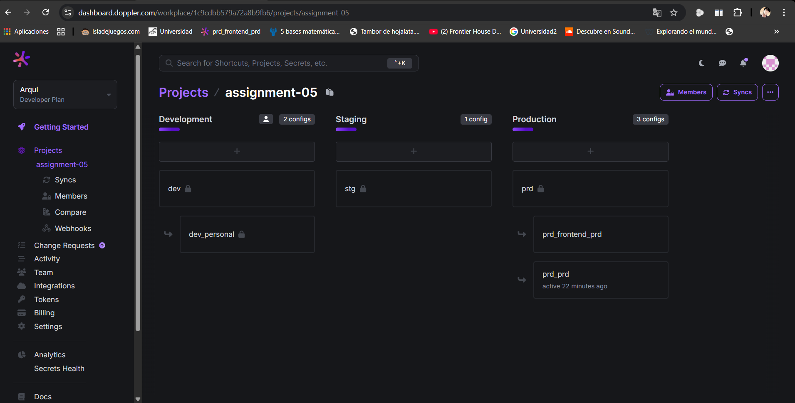
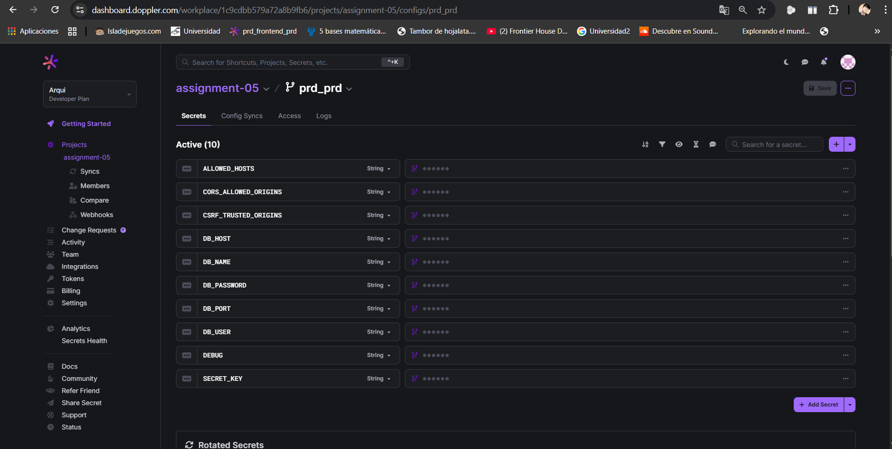
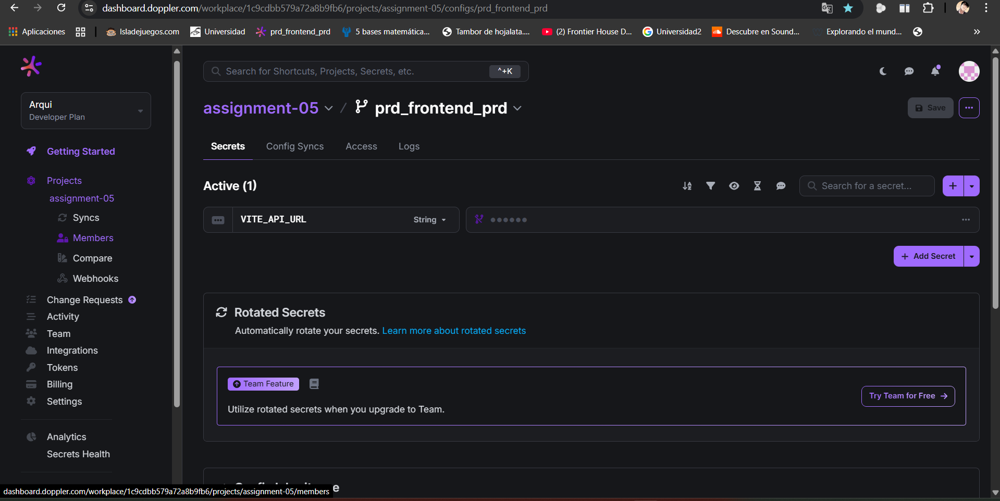

# Assignment 05 - Task Manager

## Descripción
Este proyecto consiste en una aplicación web sencilla para la gestión de tareas, desarrollada como un monorepo. La solución incluye un frontend, un backend y una base de datos, integrados mediante una API REST.

La aplicación permite:
- crear tareas
- listar tareas
- cambiar el estado de tareas
- eliminar tareas

## Tecnologías utilizadas

### Frontend
- React
- Vite

### Backend
- Django
- Django REST Framework
- drf-spectacular
- Gunicorn
- WhiteNoise

### Base de datos
- PostgreSQL

### Despliegue
- Render

### Gestión de secretos
- Doppler

## Configuración del monorepo
El proyecto fue desarrollado bajo una estructura monorepo, separando:
- `frontend/` para la interfaz de usuario
- `backend/` para la API REST y la lógica del servidor

## Migraciones
La API cuenta con migraciones realizadas en Django.

Ruta principal:
- `backend/tasks/migrations/0001_initial.py`

## URL del frontend
https://tarea-02-1.onrender.com

## URL del backend
https://tarea-02.onrender.com

## Documentación de la API
https://tarea-02.onrender.com/api/docs/

## Configuración de secretos con Doppler
Se realizó configuración de secretos con Doppler para el despliegue del backend y del frontend.

## Evidencia de base de datos
La siguiente captura corresponde a la base de datos del proyecto y coincide con la estructura definida en las migraciones de la aplicación.

## Evidencia adicional
Estas capturas se incluyen como respaldo del funcionamiento y despliegue del proyecto.

### Base de datos en PostgreSQL

### Frontend desplegado

### Documentación de la API

### Servicios desplegados en Render

### Configuración de Doppler del proyecto

### Secretos del backend en Doppler

### Secretos del frontend en Doppler

## Funcionalidades implementadas
- Crear tareas
- Listar tareas
- Cambiar estado de una tarea
- Eliminar tareas
- Documentación API con Swagger
- Despliegue en la nube de frontend, backend y base de datos
- Gestión de secretos con Doppler

## Rama de entrega
La entrega se encuentra en la rama:

`assignment-05`