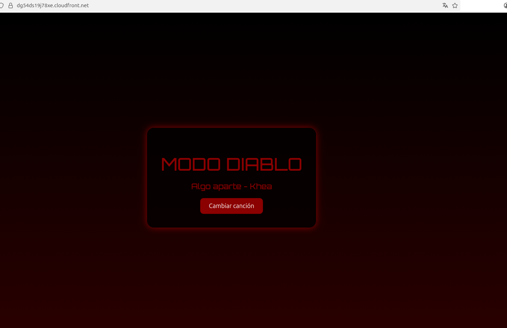
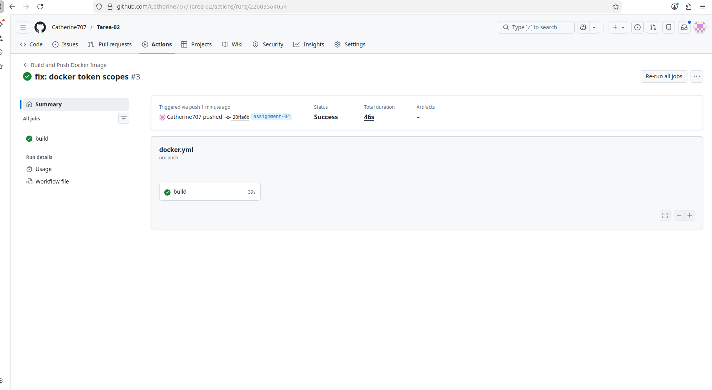
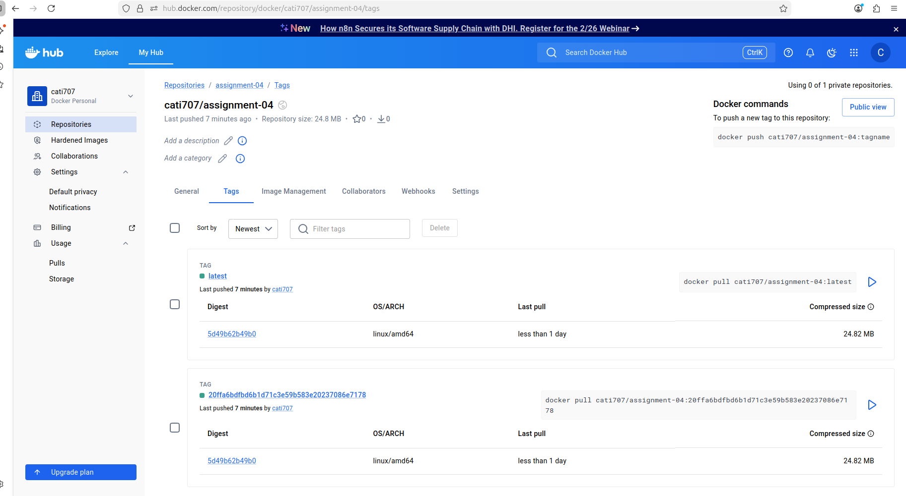

# Assignment 04 — Aplicación Vite con Docker y GitHub Actions

## Descripción

Este proyecto consiste en una aplicación desarrollada con Vite que ha sido contenedorizada utilizando Docker.  
Además, se configuró un pipeline de integración continua con GitHub Actions que construye y publica automáticamente la imagen en Docker Hub cada vez que se realizan cambios en la rama `assignment-04`.

---

## Aplicación en ejecución

La siguiente imagen muestra la aplicación ejecutándose correctamente en el navegador:



---

## Pipeline de GitHub Actions

El siguiente flujo de trabajo construye la imagen Docker y la publica automáticamente en Docker Hub:



---

## Repositorio en Docker Hub

Repositorio publicado en Docker Hub:

https://hub.docker.com/r/cati707/assignment-04

A continuación se muestran las etiquetas generadas automáticamente, incluyendo `latest` y el SHA del commit:



---

## Tecnologías utilizadas

- Vite
- Docker
- GitHub Actions
- Docker Hub

---

## Imagen Docker

Para descargar y ejecutar la imagen localmente:

```bash
docker pull cati707/assignment-04:latest
docker run -p 8080:80 cati707/assignment-04:latest
