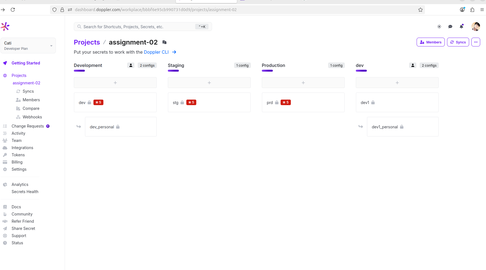
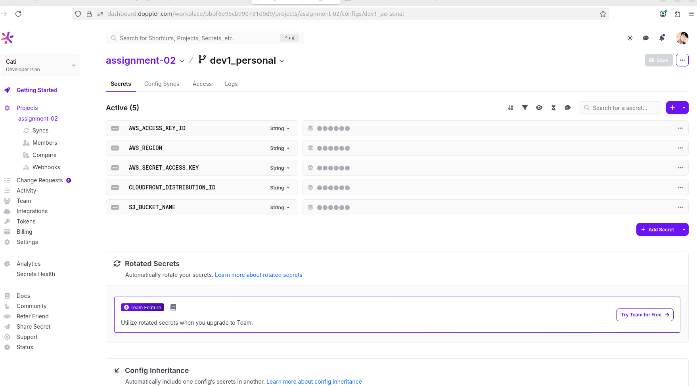
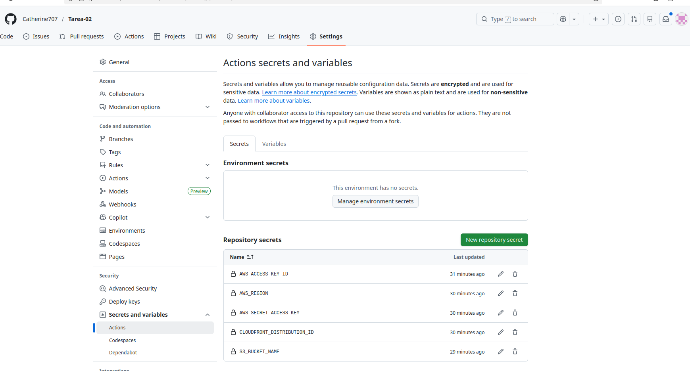
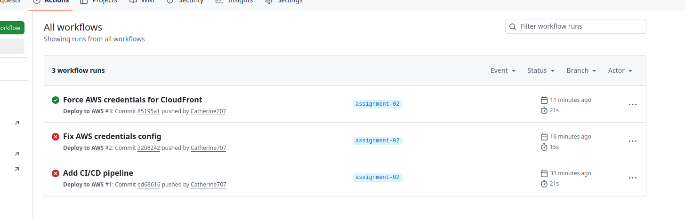
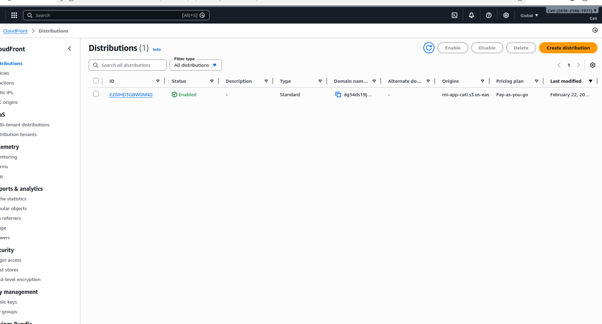

<<<<<<< HEAD
# Assignment 02 – Despliegue CI/CD con AWS

## Descripción del Proyecto

En esta actividad se desarrolló una aplicación web estática utilizando Vite.  
Se implementó un pipeline de integración y despliegue continuo (CI/CD) para que cada cambio realizado en la rama `assignment-02` se publique automáticamente en AWS.

El objetivo es que la aplicación pueda ser accedida públicamente a través de un CDN utilizando Amazon CloudFront.

---

## Aplicación en Producción

URL pública del CDN (CloudFront):

https://dg54ds19j78xe.cloudfront.net

---

## Arquitectura Implementada

El flujo de trabajo es el siguiente:

1. Se realiza un `git push` a la rama `assignment-02`.
2. GitHub Actions ejecuta automáticamente el pipeline.
3. Se instalan las dependencias del proyecto.
4. Se ejecuta el build del proyecto (`npm run build`).
5. Se sube el contenido de la carpeta `dist/` al bucket de Amazon S3.
6. Se invalida la caché de CloudFront.
7. Los cambios se reflejan inmediatamente en la URL pública del CDN.

---

## Configuración del Proyecto

- Framework utilizado: Vite
- Carpeta generada en producción: `dist/`
- Rama de trabajo: `assignment-02`
- Pipeline configurado en: `.github/workflows/deploy.yml`

---

## Pipeline de GitHub Actions

El workflow ejecuta los siguientes pasos:

- Checkout del repositorio
- Instalación de dependencias
- Build del proyecto
- Configuración de credenciales AWS
- Sincronización de archivos con S3
- Invalidación de caché en CloudFront

---

## Servicios de AWS Utilizados

- Amazon S3 (almacenamiento y hosting de archivos estáticos)
- Amazon CloudFront (CDN)
- IAM User con acceso programático para despliegue automático

---

## Configuración de Secretos

Se utilizaron secretos configurados en GitHub:

- AWS_ACCESS_KEY_ID
- AWS_SECRET_ACCESS_KEY
- AWS_REGION
- S3_BUCKET_NAME
- CLOUDFRONT_DISTRIBUTION_ID

Las credenciales fueron gestionadas mediante Doppler y sincronizadas con GitHub.

---

## Evidencias

### Integración Doppler con GitHub

### Variables configuradas en Doppler

### Secrets configurados en GitHub

### Ejecución exitosa del pipeline

### Distribución en CloudFront

### Aplicación funcionando en el navegador

---

## Autora

Catherine Cotí
