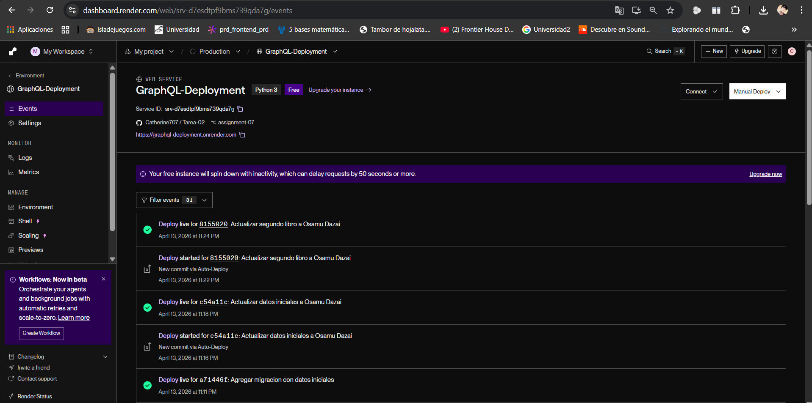
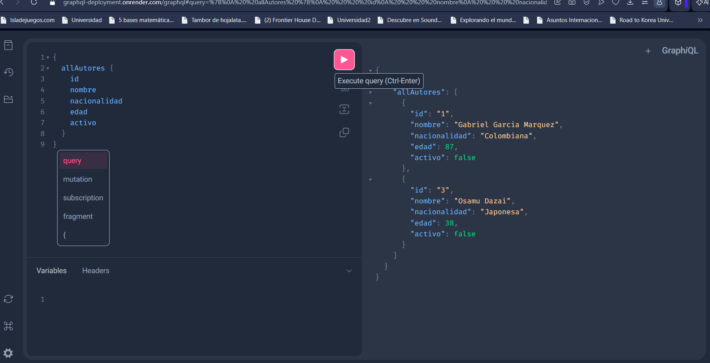
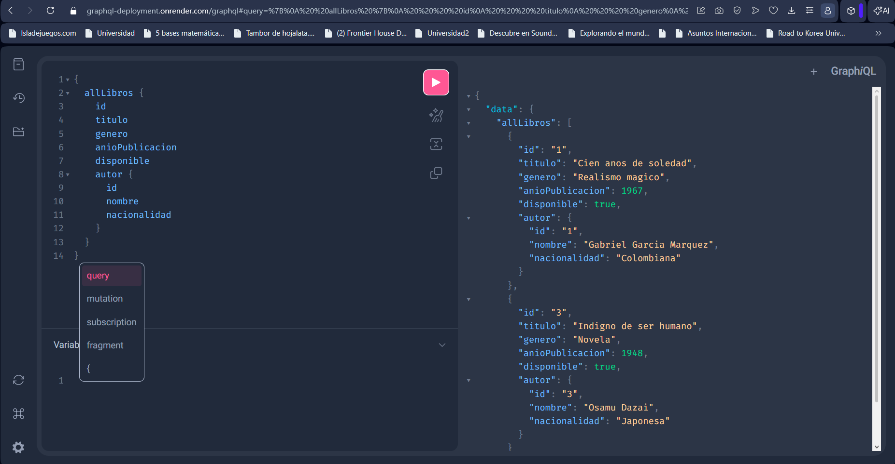
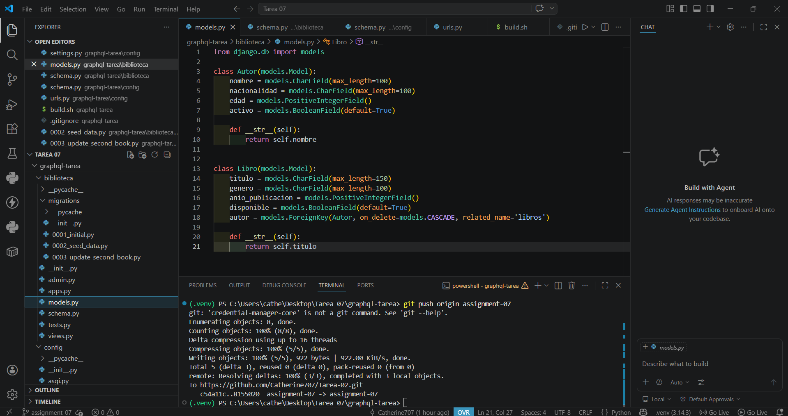
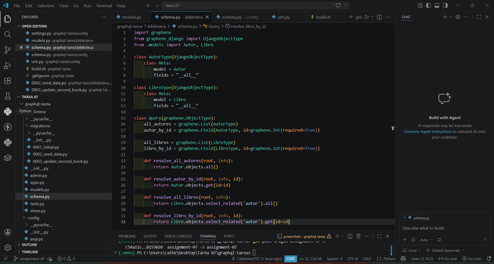

# Tarea 07 - API GraphQL con Django

## Descripción

En esta actividad se desarrolló una API utilizando **GraphQL** con **Django** y **Graphene-Django**, con el propósito de comprender cómo se pueden generar endpoints flexibles que permitan consultar únicamente los campos requeridos en cada petición, sin necesidad de crear múltiples endpoints tradicionales.

La aplicación fue desplegada en **Render**, lo que permitió exponer un **endpoint público GraphQL** sin autenticación y verificar su funcionamiento mediante consultas ejecutadas desde la interfaz GraphiQL.

---

## Tecnologías utilizadas

- Python
- Django
- Graphene-Django
- SQLite para desarrollo local
- PostgreSQL en Render
- Render
- GitHub

---

## Repositorio

Repositorio del proyecto:  
`https://github.com/Catherine707/Tarea-02/tree/assignment-07`

---

## Endpoint público

Endpoint GraphQL público:  
`https://graphql-deployment.onrender.com/graphql`

---

## Objetivo de la actividad

Comprender cómo se puede utilizar **GraphQL** para la generación de endpoints, permitiendo consultar únicamente los campos requeridos en cada petición.

---

## Modelos implementados

Para el desarrollo de la API se implementaron dos modelos principales:

- **Autor**
- **Libro**

Estos modelos fueron creados en la base de datos con varios campos para demostrar el uso correcto de GraphQL y la relación entre entidades.

---

## Esquemas de datos

### Modelo: Autor

**Descripción:**  
Representa a los autores registrados en la base de datos y asociados a los libros disponibles en la API.

**Campos disponibles:**

- `id`: identificador único del autor
- `nombre`: nombre completo del autor
- `nacionalidad`: nacionalidad del autor
- `edad`: edad del autor
- `activo`: indica si el autor se encuentra activo o no

**Ejemplos de registros:**

- Gabriel Garcia Marquez
- Osamu Dazai

### Modelo: Libro

**Descripción:**  
Representa los libros almacenados en la base de datos y relacionados con un autor.

**Campos disponibles:**

- `id`: identificador único del libro
- `titulo`: nombre del libro
- `genero`: género literario del libro
- `anioPublicacion`: año de publicación
- `disponible`: indica si el libro está disponible
- `autor`: relación con el modelo Autor

**Ejemplos de registros:**

- Cien anos de soledad
- Indigno de ser humano

---

## Relación entre modelos

El modelo **Libro** tiene una relación con el modelo **Autor**, ya que cada libro pertenece a un autor. Gracias a GraphQL, es posible consultar en una sola petición tanto la información del libro como la del autor asociado.

---

## Consultas de ejemplo

### Consulta de autores

```graphql
{
  allAutores {
    id
    nombre
    nacionalidad
    edad
    activo
  }
}
Consulta de libros
{
  allLibros {
    id
    titulo
    genero
    anioPublicacion
    disponible
    autor {
      id
      nombre
      nacionalidad
    }
  }
}
## Evidencias

### Evidencia 1. Servicio desplegado en Render

En la siguiente evidencia se muestra el servicio web desplegado correctamente en Render. Esto confirma que la API fue publicada de forma exitosa y que el proyecto quedó accesible desde internet.



### Evidencia 2. Consulta del modelo Autor en GraphQL

En esta evidencia se observa la ejecución de una consulta GraphQL sobre el modelo **Autor**, solicitando los campos `id`, `nombre`, `nacionalidad`, `edad` y `activo`, junto con la respuesta obtenida desde el endpoint público.



### Evidencia 3. Consulta del modelo Libro en GraphQL

En esta evidencia se presenta la ejecución de una consulta GraphQL sobre el modelo **Libro**, incluyendo además la relación con el modelo **Autor** para recuperar la información del autor asociado a cada libro.



### Evidencia 4. Código de los modelos en Django

En la siguiente imagen se muestra el archivo `models.py`, donde se definieron los modelos **Autor** y **Libro**, así como sus respectivos campos y la relación entre ambos.



### Evidencia 5. Código del esquema GraphQL

En esta evidencia se presenta el archivo del esquema GraphQL, donde se definieron los tipos, consultas y resolvers utilizados para acceder a la información de los modelos desde el endpoint público.



Funcionamiento de la API

La API permite consultar la información de los modelos de forma flexible mediante GraphQL. Esto significa que el cliente puede solicitar únicamente los campos que necesita, lo cual representa una de las principales ventajas de este enfoque.

Se creó un endpoint público sin autenticación y se cargaron datos de prueba en la base de datos para verificar el correcto funcionamiento de las consultas realizadas.

Resultados obtenidos

Se comprobó que la API responde correctamente a las consultas realizadas desde la interfaz GraphiQL, mostrando:

la información de los autores registrados
la información de los libros registrados
la relación entre libros y autores
el funcionamiento del endpoint público desplegado en Render
Conclusión

Se logró desarrollar e implementar una API GraphQL funcional utilizando Django y Graphene-Django. El sistema cuenta con dos modelos relacionados, un endpoint público accesible desde Render y documentación de los campos disponibles de cada modelo. Además, se verificó el correcto funcionamiento de la API mediante consultas ejecutadas exitosamente desde GraphiQL.