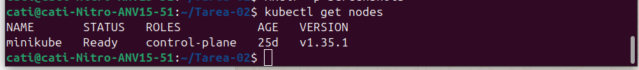
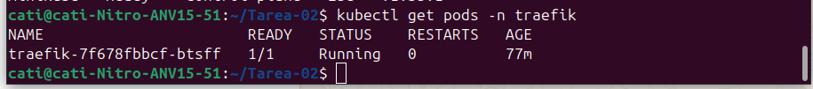
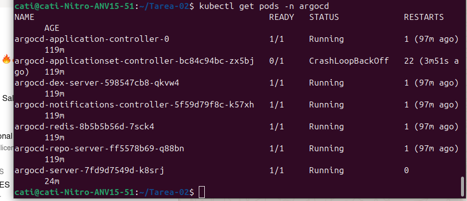
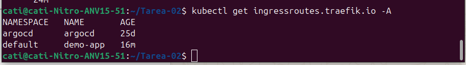
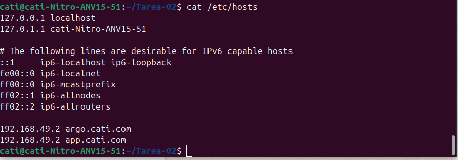
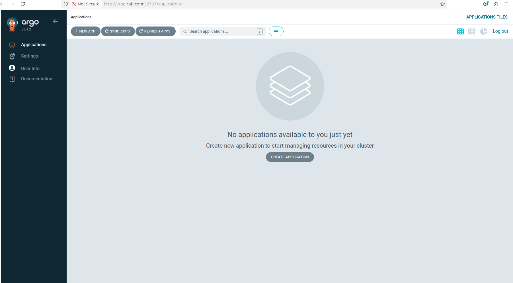
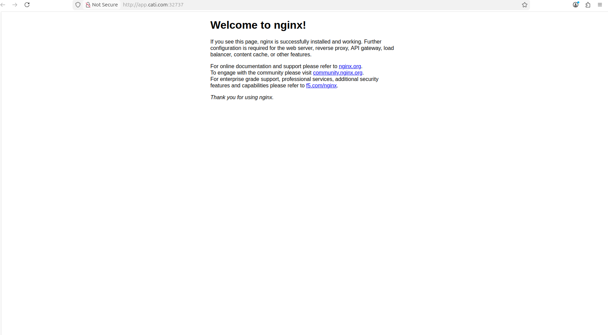

# Assignment 08 - Kubernetes con Minikube, Traefik y ArgoCD

## Descripción

En esta práctica se creó un clúster local de Kubernetes utilizando Minikube en Ubuntu.

También se instaló Traefik como Ingress Controller y ArgoCD como herramienta GitOps para administrar aplicaciones dentro del clúster.

Finalmente, se desplegó una aplicación demo utilizando Nginx y se configuraron dominios locales mediante `/etc/hosts`.

---

# Tecnologías utilizadas

- Ubuntu
- Docker
- Kubernetes
- Minikube
- kubectl
- Helm
- Traefik
- ArgoCD
- Nginx

---

# Configuración DNS local

Se agregaron los siguientes dominios al archivo:

```txt
/etc/hosts
```

```txt
192.168.49.2 argo.cati.com
192.168.49.2 app.cati.com
```

---

# URLs utilizadas

## ArgoCD

```txt
http://argo.cati.com:32737
```

## Aplicación demo

```txt
http://app.cati.com:32737
```

---

# Instalación de Minikube

```bash
minikube start --driver=docker
```

Verificación:

```bash
kubectl get nodes
```

---

# Instalación de Traefik

Crear namespace:

```bash
kubectl create namespace traefik
```

Agregar repositorio:

```bash
helm repo add traefik https://traefik.github.io/charts
helm repo update
```

Instalar Traefik:

```bash
helm install traefik traefik/traefik --namespace traefik
```

Verificación:

```bash
kubectl get pods -n traefik
```

---

# Instalación de ArgoCD

Crear namespace:

```bash
kubectl create namespace argocd
```

Instalar ArgoCD:

```bash
kubectl apply -n argocd -f https://raw.githubusercontent.com/argoproj/argo-cd/stable/manifests/install.yaml
```

Verificación:

```bash
kubectl get pods -n argocd
```

---

# Configuración insecure de ArgoCD

```bash
kubectl patch configmap argocd-cmd-params-cm -n argocd \
--type merge \
-p '{"data":{"server.insecure":"true"}}'
```

Reiniciar ArgoCD:

```bash
kubectl rollout restart deployment argocd-server -n argocd
```

---

# Manifiestos YAML

## ArgoCD IngressRoute

Archivo:

```txt
argocd/argocd-ingress.yaml
```

```yaml
apiVersion: traefik.containo.us/v1alpha1
kind: IngressRoute

metadata:
  name: argocd
  namespace: argocd

spec:
  entryPoints:
    - web

  routes:
    - match: Host(`argo.cati.com`)
      kind: Rule

      services:
        - name: argocd-server
          port: 80
```

---

## Deployment aplicación demo

Archivo:

```txt
app/deployment.yaml
```

```yaml
apiVersion: apps/v1
kind: Deployment

metadata:
  name: demo-app

spec:
  replicas: 1

  selector:
    matchLabels:
      app: demo-app

  template:
    metadata:
      labels:
        app: demo-app

    spec:
      containers:
        - name: demo-app
          image: nginx

          ports:
            - containerPort: 80
```

---

## Service aplicación demo

Archivo:

```txt
app/service.yaml
```

```yaml
apiVersion: v1
kind: Service

metadata:
  name: demo-app-service

spec:
  selector:
    app: demo-app

  ports:
    - port: 80
      targetPort: 80
```

---

## IngressRoute aplicación demo

Archivo:

```txt
app/ingress.yaml
```

```yaml
apiVersion: traefik.io/v1alpha1
kind: IngressRoute

metadata:
  name: demo-app
  namespace: default

spec:
  entryPoints:
    - web

  routes:
    - match: Host(`app.cati.com`)
      kind: Rule

      services:
        - name: demo-app-service
          port: 80
```

---

# Comandos utilizados

## Verificar nodos

```bash
kubectl get nodes
```

## Verificar Traefik

```bash
kubectl get pods -n traefik
```

## Verificar ArgoCD

```bash
kubectl get pods -n argocd
```

## Verificar IngressRoutes

```bash
kubectl get ingressroutes.traefik.io -A
```

## Aplicar manifiestos

```bash
kubectl apply -f argocd/argocd-ingress.yaml
kubectl apply -f app/
```

---

# Evidencias

## Cluster Minikube funcionando



---

## Traefik funcionando



---

## ArgoCD funcionando



---

## IngressRoutes configurados



---

## DNS local configurado



---

## ArgoCD desde navegador



---

## Aplicación demo desde navegador



---

# Estructura del proyecto

```txt
.
├── app
│   ├── deployment.yaml
│   ├── ingress.yaml
│   └── service.yaml
├── argocd
│   └── argocd-ingress.yaml
├── screenshots
│   ├── app-web.png
│   ├── argocd-pods.png
│   ├── argocd-web.png
│   ├── cluster.png
│   ├── dns.png
│   ├── ingressroutes.png
│   └── traefik.png
└── README.md
```

---

# Rama utilizada

```txt
assignment-08
```

---

# Repositorio

```txt
https://github.com/Catherine707/Tarea-02
```
